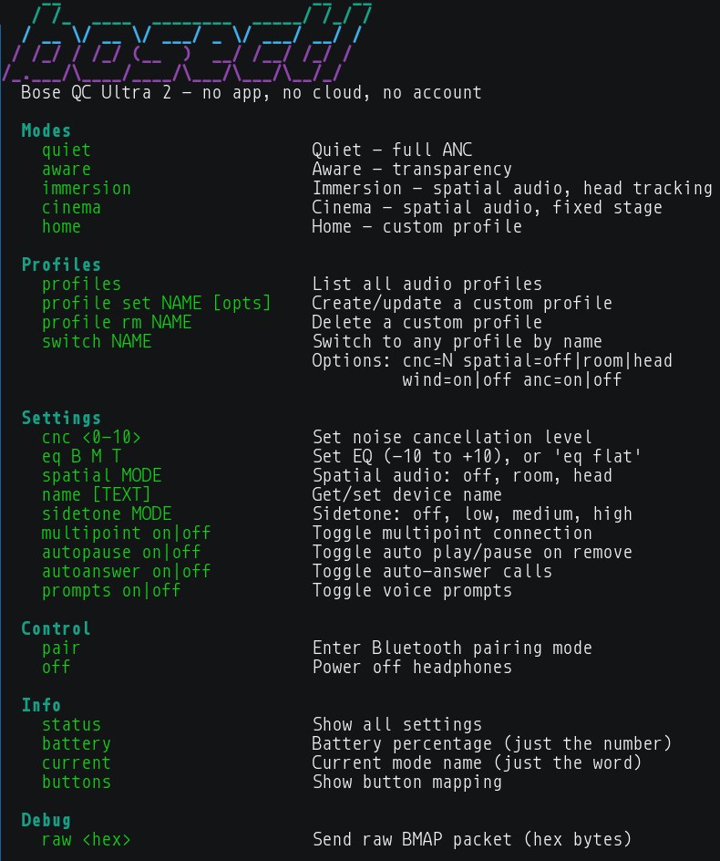

# bosectl

[](LICENSE)
[](https://www.python.org)
[](https://www.rust-lang.org)
[](https://en.cppreference.com)
[](https://kernel.org)

**Control Bose headphones from Linux — no app, no cloud, no account.**



Libraries in Python, Rust, and C++ implementing the Bose BMAP protocol
over Bluetooth RFCOMM. Full control over noise cancellation, EQ, spatial
audio, button mapping, profiles, and device settings through a direct
connection to the headphones.

> **This is not an exploit.** We use the BMAP protocol's standard SETGET
> operator, which the headphones accept without authentication. No keys
> are extracted, no encryption is broken, no traffic is replayed.

## Supported Devices

| Device | NC Control | EQ | Spatial | Profiles | Buttons | Status |
|--------|-----------|-----|---------|----------|---------|--------|
| **QC Ultra Headphones 2** | CNC 0-10 slider | 3-band | room/head | 7 custom slots | Shortcut remap | Verified |
| **QuietComfort 35 / 35 II** | ANR off/high/wind/low | — | — | — | Action remap (VPA/ANC) | Verified |

### Device Roadmap

The library includes a [device catalog](docs/architecture.md#device-catalog)
of all known BMAP-capable Bose products. These are recognized by Bluetooth
product ID but don't have tested configurations yet — contributions welcome:

| Device | Codename | Category | PID |
|--------|----------|----------|-----|
| Noise Cancelling Headphones 700 | goodyear | Headphones | `0x4024` |
| QuietComfort 45 | vedder | Headphones | `0x4061` |
| QuietComfort Earbuds II | olivia | Earbuds | `0x4060` |
| QuietComfort Ultra Earbuds | prince | Earbuds | `0x4075` |
| Ultra Open Earbuds | edith | Earbuds | `0x4063` |
| SoundLink Flex (1st & 2nd gen) | duran / scotty | Speaker | `0x4039` / `0x4073` |
| SoundLink Max | lonestarr | Speaker | `0x4066` |

Adding a new device is a configuration entry — no library code changes needed.
See [Adding a New Device](docs/architecture.md#adding-a-new-device).

## Quick Start

### Library Usage

```python
import pybmap

with pybmap.connect() as dev:
    print(dev.battery())            # 80
    print(dev.name())               # "Obsidian Countess"
    dev.set_anr("high")             # QC35: full noise cancellation
    dev.set_cnc(8)                  # QC Ultra 2: CNC level 0-10
    dev.set_eq(3, 0, -2)            # Bass +3, mid flat, treble -2
    dev.set_buttons(0x10, 4, 2)     # Remap Action button to ANC
```

```rust
use bmap::connect;

let dev = connect(None, None)?;
println!("{}%", dev.battery()?);    // 80
dev.set_anr("high")?;              // QC35
dev.set_cnc(8)?;                   // QC Ultra 2
```

```cpp
#include "bmap.h"

auto dev = bmap::connect();
std::cout << (int)dev->battery() << "%\n";
dev->set_anr("high");              // QC35
dev->set_cnc(8);                   // QC Ultra 2
```

### CLI Usage

```bash
# Auto-detects paired Bose device
bosectl status              # Show model, battery, mode, settings
bosectl cnc 7               # Noise cancellation level (QC Ultra 2)
bosectl anr high            # Noise cancellation mode (QC35)
bosectl eq 3 0 -2           # EQ: bass/mid/treble
bosectl buttons set ANC     # Remap programmable button
bosectl quiet               # Switch to Quiet mode
```

### Device Catalog API

```python
import pybmap

# Look up any known Bose device by product ID
dev = pybmap.lookup_device(0x4082)
print(dev.name)       # "QuietComfort Ultra Headphones"
print(dev.codename)   # "wolverine"

# USB/Bluetooth identification
pybmap.usb_ids(0x4082)    # (0x05A7, 0x4082)
pybmap.modalias(0x4082)   # "bluetooth:v05A7p4082d0000"

# Check support status
pybmap.is_supported(0x4082)  # True — has tested config
pybmap.is_supported(0x4061)  # False — QC45, recognized but untested
pybmap.supported_devices()   # [kleos, baywolf, wolverine]
pybmap.known_devices()       # all 14 BMAP devices
```

## Installation

### Prerequisites

- **Linux** with BlueZ (standard Bluetooth stack)
- **Bluetooth** adapter (built-in or USB)
- **Bose headphones** paired via `bluetoothctl`

### From Release Binaries

```bash
# Download from GitHub releases
curl -LO https://github.com/aaronsb/bosectl/releases/latest/download/bmapctl-rust-linux-x86_64
curl -LO https://github.com/aaronsb/bosectl/releases/latest/download/SHA256SUMS
sha256sum -c SHA256SUMS
chmod +x bmapctl-rust-linux-x86_64
sudo cp bmapctl-rust-linux-x86_64 /usr/local/bin/bmapctl
```

### From Source

```bash
git clone https://github.com/aaronsb/bosectl.git
cd bosectl
make test          # Run all tests (Python + Rust + C++)
make artifacts     # Build release binaries + SHA256SUMS
```

See `make help` for all targets.

### Pairing

If your headphones aren't already paired:

```bash
bluetoothctl
> scan on
> pair XX:XX:XX:XX:XX:XX
> trust XX:XX:XX:XX:XX:XX
> connect XX:XX:XX:XX:XX:XX
> exit
```

`bosectl` auto-detects paired Bose devices by their BMAP service UUID —
no MAC address configuration needed, even with renamed headphones.

## Architecture

Three libraries sharing the same layered design:

```
Application → BmapConnection → Device Config → Transport → Protocol → Bluetooth RFCOMM
```

- **Protocol** — binary BMAP packet codec
- **Transport** — RFCOMM socket with drain mode for async responses
- **Device Config** — data-only description of each headphone model (addresses, parsers, quirks)
- **BmapConnection** — typed API that dispatches to the right address/parser per device
- **Catalog** — all known Bose BMAP devices with product IDs, codenames, and USB identifiers

Device differences (RFCOMM channel, init packets, feature availability) are
expressed as config data, not code branches. Adding a new device is a
config entry pointing to existing parsers.

Full documentation: **[docs/architecture.md](docs/architecture.md)**

## How It Works

Bose headphones speak **BMAP** (Bose Messaging and Protocol) over
Bluetooth RFCOMM. The protocol is organized into function blocks
(groups of features) and operators (read, write, action).

The key insight: while Bose gates SET (operator 0) behind cloud-mediated
ECDH authentication, **SETGET** (operator 2) and **START** (operator 5)
are unauthenticated on the Settings and AudioModes blocks. This gives
full control over every user-facing setting.

Full protocol reference: **[NOTES.md](NOTES.md)**

### How We Found This

1. Connected over RFCOMM, probed all channels — channel 2 (QC Ultra 2) and 8 (QC35) responded with BMAP
2. Captured Bluetooth HCI traffic while toggling settings in the Bose app
3. DNS-hijacked the cloud API and noticed mode switching still worked — the app uses START, not SET
4. Systematically tested every operator on every function block to map the auth boundary

## Project Structure

```
├── python/pybmap/       # Python library + bosectl CLI
├── rust/src/            # Rust library + bmapctl CLI
├── cpp/src/             # C++ library + bmapctl CLI
├── docs/                # Architecture guide, device docs
├── NOTES.md             # Protocol reverse engineering notes
├── Makefile             # Build, test, release across all languages
└── fixtures/            # Captured protocol data
```

## Building & Releasing

```bash
make test                       # All tests (119 Python, 59 Rust, 51 C++)
make artifacts                  # Build + strip + SHA256SUMS in dist/
make release VERSION=v0.2.0     # Test → build → gh release create
make clean                      # Remove all build artifacts
```

## License

MIT
