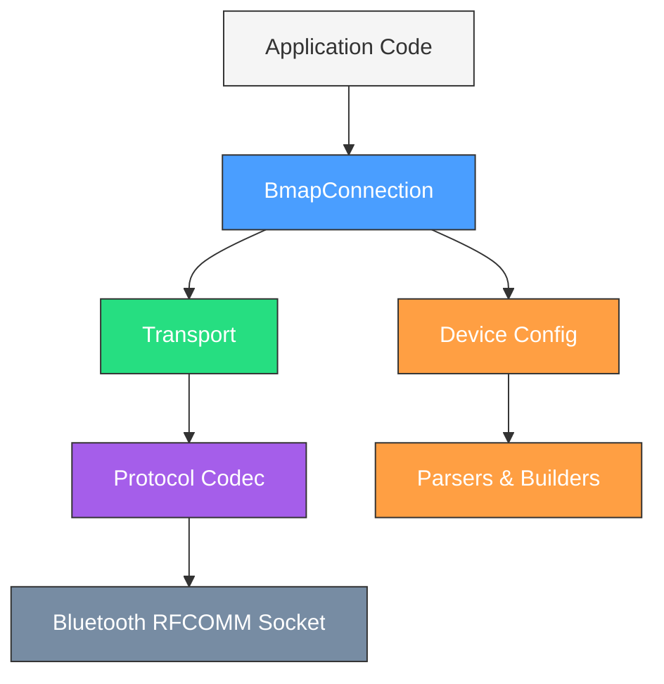
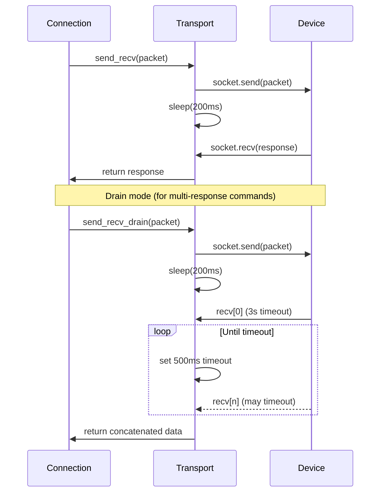
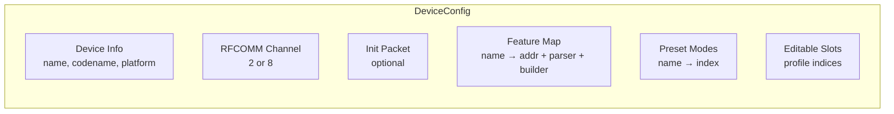
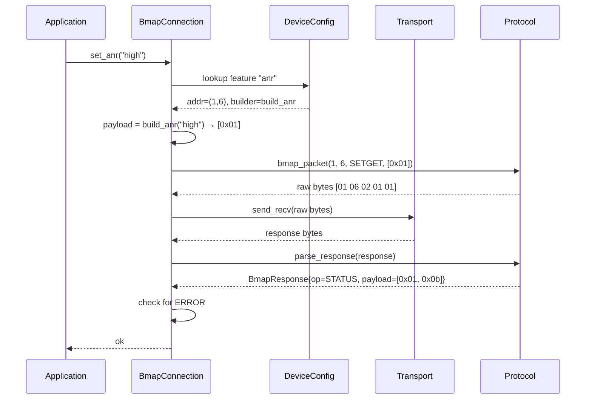
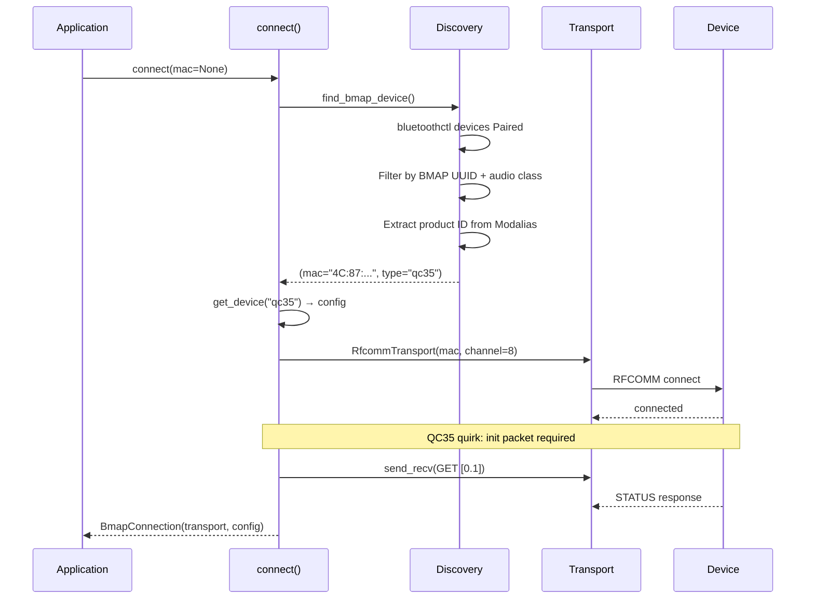
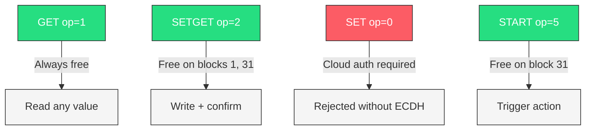
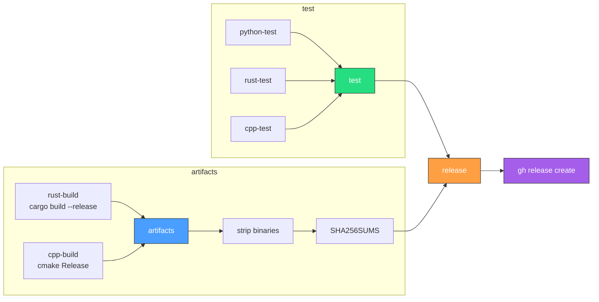

# BMAP Library Architecture

This guide covers the shared architecture of the BMAP protocol libraries
(Python, Rust, C++). All three implement the same layered design and
feature-dispatch model. Language-specific details are in
[Language Implementations](#language-implementations) at the end.

## Overview

The BMAP library controls Bose Bluetooth headphones over RFCOMM without
the Bose app, cloud accounts, or authentication. It works by speaking the
BMAP (Bose Media Application Protocol) binary protocol directly over a
Bluetooth serial connection.



## Layers

### Protocol Codec

The lowest layer. Encodes and decodes raw BMAP packets on the wire.

**Packet format:**
```
Byte 0:    fblock     — function block ID (e.g. 1=Settings, 2=Status, 31=AudioModes)
Byte 1:    func       — function ID within the block
Byte 2:    flags      — operator in low nibble (& 0x0F), upper bits carry
                         device_id and port_num (typically zero)
Byte 3:    length     — payload length in bytes
Byte 4+:   payload    — operation-specific data
```

**Functions:**
- `bmap_packet(fblock, func, operator, payload)` — encode a request
- `parse_response(data)` — decode a single response frame
- `parse_all_responses(data)` — split concatenated frames (used after drain)
- `encode_mode_name(name)` — UTF-8 to 32-byte null-padded buffer

**Operators:**

| Code | Name     | Direction     | Description |
|------|----------|---------------|-------------|
| 0    | SET      | Request       | Write (requires cloud auth) |
| 1    | GET      | Request       | Read a value |
| 2    | SETGET   | Request       | Write + read back (no auth on most blocks) |
| 3    | STATUS   | Response      | Data response / unsolicited notification |
| 4    | ERROR    | Response      | Error with code in payload[0] |
| 5    | START    | Request       | Trigger an action |
| 6    | RESULT   | Response      | Action completed |
| 7    | PROCESSING | Response    | Async operation in progress |

### Transport

Manages the Bluetooth RFCOMM socket connection.



**Key behaviors:**
- **Normal mode**: Send packet, wait up to 3 seconds for one response
- **Drain mode**: Send packet, collect all responses until 500ms silence — used for commands that return multiple STATUS frames (e.g. `GetAll`)
- **200ms post-send delay**: Required by the BMAP protocol between send and first recv

The drain interface differs slightly by language: Python uses a boolean
parameter (`send_recv(packet, drain=True)`), while Rust and C++ have a
separate method (`send_recv_drain(packet)`).

### Device Config

A data-only description of a specific headphone model. No logic — just addresses,
parser/builder function references, and capability flags.



Each feature entry maps a name to its protocol address and codec functions:

```
"anr" → {
    addr:    (1, 6)          — fblock 1, function 6
    parser:  parse_anr       — bytes → "high"/"low"/"wind"/"off"
    builder: build_anr       — "high" → bytes([0x01])
}
```

**Device quirks are expressed as config differences, not code branches:**

| Property | QC Ultra 2 | QC35 |
|----------|-----------|------|
| RFCOMM channel | 2 | 8 |
| Init packet | None | GET [0.1] required |
| Noise control | CNC [1.5] (0-10 slider) | ANR [1.6] (off/high/wind/low) |
| EQ | 3-band [1.7] | Not supported |
| Spatial audio | [31.6] ModeConfig | Not supported |
| Mode profiles | 7 editable slots (4-10) | None |
| Sidetone | [1.11] | [1.11] |
| Multipoint | [1.10] | Not supported |
| Button remap | Shortcut (0x80) | Action (0x10) |

### BmapConnection

The primary public API. Composes a transport with a device config to provide
typed read/write methods. All feature methods use the same dispatch pattern:



**Read pattern** (GET):
```
battery()  →  _get("battery")  →  lookup addr  →  send GET  →  parse response  →  apply parser
```

**Write pattern** (SETGET):
```
set_anr("high")  →  lookup addr + builder  →  build payload  →  send SETGET  →  check for errors
```

**Action pattern** (START + drain):
```
modes()  →  _start_drain("get_all_modes")  →  send START  →  drain all STATUS  →  parse each  →  collect
```

### Parsers & Builders

Pure functions that convert between wire bytes and typed values.
Shared across device configs — a parser is referenced by name in the
feature map, not inherited.

**Parsers** decode response payloads:
```
parse_battery([0x50, 0xff, 0xff, 0x00])  →  80
parse_cnc([0x0b, 0x07, 0x03])            →  (current=7, max=10)
parse_anr([0x01, 0x0b])                  →  "high"
parse_buttons([0x10, 0x04, 0x01, 0x07])  →  ButtonMapping{Action, single_press, VPA}
```

**Builders** encode request payloads:
```
build_anr("high")                         →  bytes([0x01])
build_sidetone(2)                         →  bytes([0x01, 0x02])
build_buttons(0x10, 4, 2)                 →  bytes([0x10, 0x04, 0x02])
build_mode_config_40(5, "Custom", cnc_level=8)  →  40-byte payload
```

Builders accept both integer IDs and string names where applicable
(e.g. `build_buttons("Action", "single_press", "ANC")`).

## Connection Lifecycle



**Discovery** uses `bluetoothctl` to enumerate paired devices, filtering by:
1. Device class contains `audio-headset` or `audio-headphones`
2. SDP records contain BMAP UUID `00000000-deca-fade-deca-deafdecacaff`
3. Modalias product ID maps to a known device type

Connected devices are preferred over paired-but-disconnected.

## Error Handling

BMAP errors are returned in ERROR (op 4) responses with an error code
in `payload[0]`:

| Code | Name | Meaning |
|------|------|---------|
| 1 | Length | Payload size wrong |
| 3 | FblockNotSupp | Function block doesn't exist |
| 4 | FuncNotSupp | Function doesn't exist in block |
| 5 | OpNotSupp | Requires cloud-mediated ECDH auth |
| 6 | InvalidData | Value out of range or wrong format |
| 8 | Runtime | Firmware-level rejection (e.g. preset mode locked) |
| 10 | InvalidState | Pre-requisite not met |
| 15 | InvalidTransition | State machine violation |
| 20 | InsecureTransport | Encrypted link required |

The library surfaces these at appropriate levels:
- **Unsupported feature** → raised immediately at lookup time (not sent to device)
- **Auth error (code 5)** → distinct error type for programmatic handling
- **Device errors** → include the error code and formatted response

## Authentication Model

BMAP has two write paths with different auth requirements:



The library uses SETGET (not SET) for all writes and START for mode
switching. This gives full control over settings, profiles, and modes
without any authentication.

## Device Catalog

The catalog module (`catalog.py` / `catalog.rs` / `catalog.h`) is the
single source of truth for all known Bose BMAP devices. It's sourced from
Bose's firmware manifest at `downloads.bose.com/lookup.xml`.

```mermaid
graph TD
    CAT[Device Catalog<br/>14 known BMAP devices] --> SUP[Supported<br/>config ≠ None]
    CAT --> UNSUP[Recognized but Unsupported<br/>config = None]
    SUP --> DISC[Discovery<br/>PID → config lookup]
    SUP --> CFG[Device Configs<br/>qc_ultra2, qc35]
    DISC --> CONN[connect&#40;&#41;]
    CFG --> CONN

    style CAT fill:#ff9f43,stroke:#333,color:#fff
    style SUP fill:#26de81,stroke:#333,color:#fff
    style UNSUP fill:#778ca3,stroke:#333,color:#fff
    style DISC fill:#4a9eff,stroke:#333,color:#fff
    style CFG fill:#4a9eff,stroke:#333,color:#fff
    style CONN fill:#4a9eff,stroke:#333,color:#fff
```



Each catalog entry carries:

| Field | Description | Example |
|-------|-------------|---------|
| `product_id` | USB PID / Bluetooth Modalias ID | `0x4082` |
| `codename` | Bose internal codename | `"wolverine"` |
| `name` | Marketing product name | `"QuietComfort Ultra Headphones (2nd Gen)"` |
| `category` | `headphones`, `earbuds`, or `speaker` | `headphones` |
| `config` | Library config key, or None | `"qc_ultra2"` |

**Public API** (identical across all three libraries):

```
lookup_device(0x4082)    → BoseDevice{wolverine, "QuietComfort Ultra Headphones (2nd Gen)", config="qc_ultra2"}
is_supported(0x4024)     → False (NCH 700: recognized, no config yet)
supported_devices()      → [wolfcastle, baywolf, edith, wolverine]
known_devices()          → full APK-sourced catalog
usb_ids(0x4082)          → (0x05A7, 0x4082)
modalias(0x4082)         → "bluetooth:v05A7p4082d0000"
```

The USB vendor ID `0x05A7` is shared by all Bose devices. The catalog
is sourced from the decompiled Bose Music APK (`BoseProductId.java`
enum) — the enum's `value` field is what the device reports in the
Bluetooth Modalias string. Note that USB DFU PIDs (as listed by
projects like bose-dfu) are a **different ID space** and should not be
conflated with BT Modalias PIDs.

Discovery uses the catalog to resolve product IDs to config keys. Devices
with `config=None` are recognized (logged, not errored) but fall back to
a default config since they don't have a tested implementation yet.

### Supported Devices

| PID | Codename | Product | Config |
|-----|----------|---------|--------|
| `0x400C` | wolfcastle | QuietComfort 35 | `qc35` |
| `0x4020` | baywolf | QuietComfort 35 II | `qc35` |
| `0x4062` | edith | QuietComfort Ultra Earbuds (2nd Gen) | `qc_ultra2` |
| `0x4082` | wolverine | QuietComfort Ultra Headphones (2nd Gen) | `qc_ultra2` |

### Known Unsupported (Future Targets)

See `catalog.py` / `catalog.rs` / `catalog.h` for the full APK-sourced
device list. Entries with `config=None` are recognized but not yet
implemented.

## Adding a New Device

To add support for a new Bose device:

1. **Add to the catalog** — add its PID, codename, and name with `config=None`
2. **Discover the RFCOMM channel** — try channels 2 and 8
3. **Check if an init packet is needed** — send GET [0.1] and see if subsequent commands work
4. **Probe features** — GET on known function addresses to see what responds
5. **Create a device config** with the discovered addresses and parsers
6. **Register in the device registry** — add to `get_device()` / `DEVICES`
7. **Set config in catalog** — change `None` to the new config key

No changes to `BmapConnection` or the transport layer should be needed.
Device-specific parsing (e.g. different ModeConfig layouts) is handled by
assigning a different parser function in the config.

---

## Language Implementations

All three implementations follow the architecture above. The differences
are in how each language expresses the patterns.

### Python (`python/pybmap/`)

```
pybmap/
├── __init__.py          # connect() entry point, public API re-exports
├── catalog.py           # Device catalog (PIDs, codenames, USB/Modalias IDs)
├── protocol.py          # Packet codec (bmap_packet, parse_response)
├── transport.py         # RfcommTransport (AF_BLUETOOTH socket)
├── connection.py        # BmapConnection class
├── discovery.py         # find_bmap_device() via bluetoothctl
├── constants.py         # Operators, error codes, button/action/language tables
├── types.py             # NamedTuples (BmapResponse, ModeConfig, ButtonMapping, etc.)
├── errors.py            # Exception hierarchy
└── devices/
    ├── __init__.py      # Device registry (DEVICES dict, get_device())
    ├── parsers.py       # Shared parser/builder functions
    ├── qc_ultra2.py     # QC Ultra 2 config (module-level constants)
    └── qc35.py          # QC35 config (module-level constants)
```

**Device configs** are Python modules with module-level constants.
Features are dicts mapping names to `{"addr": (fblock, func), "parser": fn, "builder": fn}`.
This makes feature dispatch a simple dict lookup at runtime.

**Error handling** uses a typed exception hierarchy:
```
BmapError
├── BmapConnectionError   — socket/transport failures
├── BmapAuthError         — device returned error code 5
├── BmapDeviceError       — device returned other error codes
├── BmapTimeoutError      — no response within timeout
└── BmapNotFoundError     — no device found during discovery
```

**Transport** uses Python's `socket` module with `AF_BLUETOOTH`.
No abstraction layer — `RfcommTransport` is a concrete class.

**Testing**: `pytest` with real-capture test data. No transport mock in
parser tests (parsers are pure functions). Connection tests use a
`MockTransport` helper.

### Rust (`rust/src/`)

```
rust/src/
├── lib.rs               # connect() entry point, public re-exports
├── catalog.rs           # Device catalog (PIDs, codenames, USB/Modalias IDs)
├── protocol.rs          # Packet codec, BmapResponse struct
├── transport.rs         # Transport trait + RfcommTransport (libc sockets)
├── connection.rs        # BmapConnection<T: Transport> generic struct
├── discovery.rs         # find_bmap_device() via bluetoothctl
├── device.rs            # DeviceConfig struct, all parsers/builders
├── devices.rs           # qc_ultra2() / qc35() factory functions
├── error.rs             # BmapError enum, BmapResult type alias
└── main.rs              # CLI binary (bmapctl)
```

**Device configs** are returned by factory functions (`qc_ultra2() -> DeviceConfig`).
Features are `Option<Addr>` fields on the struct — `None` means unsupported.
The compiler enforces that unsupported features can't be called without
handling the `None` case.

**Feature dispatch** is method-based rather than dict-based. Each
`BmapConnection` method knows which config field to read:
```rust
pub fn anr(&self) -> BmapResult<&'static str> {
    let addr = self.addr(self.config.anr)?;  // None → Unsupported error
    let payload = self.get(addr)?;
    Ok(parse_anr(&payload))
}
```

**Transport** is a trait (`Transport`), enabling mock transports in tests:
```rust
pub trait Transport {
    fn send_recv(&self, packet: &[u8]) -> BmapResult<Vec<u8>>;
    fn send_recv_drain(&self, packet: &[u8]) -> BmapResult<Vec<u8>>;
}
```

`BmapConnection<T: Transport>` is generic over the transport, so tests
use `BmapConnection<MockTransport>` with canned responses.

**Error handling** uses `Result<T, BmapError>` with an enum:
```rust
pub enum BmapError {
    Connection(String),
    Auth(String),
    Device { message: String, code: u8 },
    Timeout(String),
    NotFound(String),
    Unsupported(String),
    InvalidArg(String),
}
```

### C++ (`cpp/src/`)

```
cpp/src/
├── bmap.h               # connect() function, public header
├── catalog.h            # Device catalog (PIDs, codenames, USB/Modalias IDs)
├── protocol.h           # Packet codec (header-only)
├── transport.h          # Transport abstract class
├── transport.cpp        # RfcommTransport (BlueZ sockets)
├── connection.h         # BmapConnection class (header-only)
├── device.h             # DeviceConfig, all parsers/builders (header-only)
├── devices.h            # qc_ultra2() / qc35() inline functions
├── discovery.h          # find_bmap_device() declaration
├── discovery.cpp        # Discovery implementation
└── main.cpp             # CLI binary (bmapctl)
```

**Mostly header-only**: Only `transport.cpp` and `discovery.cpp` have
compiled implementations (they use system calls). Everything else —
protocol, parsers, device configs, connection — is in headers.

**Device configs** are inline functions returning `DeviceConfig` structs.
Features use `std::optional<Addr>` — same pattern as Rust's `Option<Addr>`.

**Transport** is an abstract class with virtual methods:
```cpp
class Transport {
public:
    virtual std::vector<uint8_t> send_recv(const std::vector<uint8_t>& packet) = 0;
    virtual std::vector<uint8_t> send_recv_drain(const std::vector<uint8_t>& packet) = 0;
    virtual ~Transport() = default;
};
```

Tests use a `MockTransport` subclass.

**Error handling** uses `std::runtime_error` exceptions. No typed
hierarchy — auth errors (code 5) are not programmatically distinguishable
from other device errors without parsing the message string. The `require()` helper
converts `std::nullopt` to an exception for unsupported features:
```cpp
static Addr require(const std::optional<Addr>& opt, const char* name) {
    if (!opt) throw std::runtime_error(std::string(name) + " not supported");
    return *opt;
}
```

**Ownership**: `BmapConnection` owns the transport via `std::unique_ptr<Transport>`.
The `connect()` function returns `std::unique_ptr<BmapConnection>`.

---

## Building & Testing

A top-level `Makefile` orchestrates all three implementations.
Prerequisites: Python 3, Rust/Cargo, CMake, GCC/Clang, `libbluetooth-dev`.

### Quick Start

```bash
make test        # run all test suites (Python + Rust + C++)
make artifacts   # build release binaries + SHA256SUMS
```

### Available Targets

| Target | Description |
|--------|-------------|
| `make test` | Run all tests across all three languages |
| `make python-test` | Python unit tests (auto-creates virtualenv) |
| `make rust-test` | Rust tests via `cargo test` |
| `make cpp-test` | C++ tests via CMake + ctest |
| `make artifacts` | Build release binaries, strip, generate checksums |
| `make release VERSION=vX.Y.Z` | Full release: test → build → `gh release create` |
| `make clean` | Remove all build artifacts, venvs, dist/ |
| `make integration` | Integration tests (requires paired Bluetooth device) |
| `make help` | Show all targets |

### Build Flow



### Release Process

```bash
# 1. Ensure all tests pass and artifacts build
make test
make artifacts

# 2. Create a tagged release with binaries
make release VERSION=v0.2.0

# This runs: test → artifacts → gh release create
# Binaries are named: bmapctl-{rust,cpp}-linux-{arch}
# SHA256SUMS is included for verification
```

### Artifact Verification

```bash
# Download and verify
cd dist/
sha256sum -c SHA256SUMS

# Install
chmod +x bmapctl-rust-linux-x86_64
sudo cp bmapctl-rust-linux-x86_64 /usr/local/bin/bmapctl
```

### Language-Specific Builds

Each language can be built independently:

```bash
# Python — virtualenv auto-created
make python-setup   # create venv, install deps
make python-test    # run pytest
make python-build   # sdist + wheel in python/dist/

# Rust
make rust-build     # cargo build --release
make rust-test      # cargo test

# C++
make cpp-build      # cmake + make (Debug)
make cpp-test       # build + run bmap_tests
```
